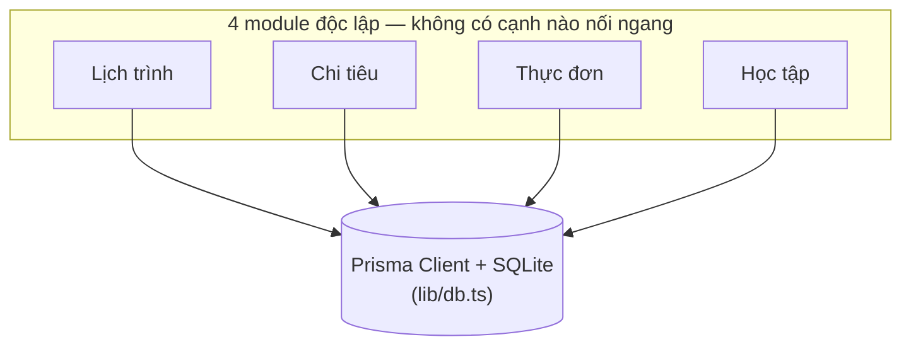
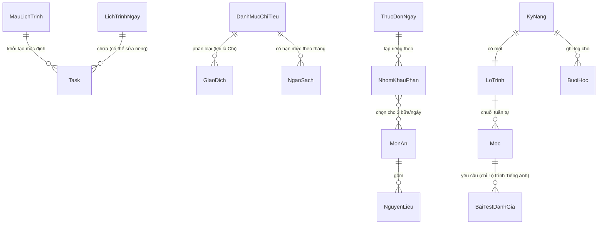

# Architecture Spine — App Quản Lý Cá Nhân Đa Năng

## Design Paradigm

**Layered monolith qua Next.js App Router (Server Components + Server Actions), một tiến trình Node.js duy nhất, dữ liệu bền vững qua Prisma trên một file SQLite cục bộ.** Không có tầng REST/API tách biệt, không có tiến trình backend riêng — UI và mutation logic cùng chạy trong một Next.js server process.

Ba tầng, ánh xạ trực tiếp sang thư mục (chi tiết ở Structural Seed):

| Tầng | Vai trò | Thư mục |
| --- | --- | --- |
| Presentation | React Server/Client Components, route theo App Router | `app/` |
| Mutation | Server Actions — cổng ghi dữ liệu duy nhất | `app/<module>/actions.ts` |
| Data | Prisma Client + schema, tầng duy nhất chạm SQLite | `prisma/schema.prisma`, `lib/db.ts` |

## Invariants & Rules

### AD-1 — Ranh giới 4 module độc lập

- **Binds:** FR-1..FR-13 (`all`)
- **Prevents:** một module đọc/ghi trực tiếp bảng Prisma của module khác, gây kết dính ngầm giữa 4 mảng vốn được PRD xác nhận là không phụ thuộc lẫn nhau (§6.1: "không module nào chặn module khác").
- **Rule:** mỗi module trong 4 module (Lịch trình, Chi tiêu, Thực đơn, Học tập) sở hữu độc quyền tập model Prisma của riêng nó — kể cả đọc. Server Action hoặc truy vấn của một module không được import/gọi trực tiếp model Prisma thuộc module khác. Tầng tổng hợp ở `app/(dashboard)/` (màn Hôm nay) chỉ được lấy dữ liệu 4 module qua các hàm đọc mà mỗi module tự export (ví dụ `layTomTatHomNay()` khai báo trong `queries.ts` của từng module) — không bao giờ tự import Prisma model của module khác để query trực tiếp, kể cả cho mục đích chỉ-đọc. Đây cũng là dạng tổng quát hoá của non-goal "Thực đơn không liên kết Chi tiêu" áp cho cả 4 module, không riêng cặp Thực đơn–Chi tiêu.

### AD-2 — Tách config hiện hành khỏi dữ liệu lịch sử [ADOPTED]

- **Binds:** FR-1, FR-2, FR-3, FR-5, FR-13
- **Prevents:** sửa một "bản hiện hành" (Mẫu lịch trình, Ngân sách tháng đang chạy, vị trí hiện tại trên Lộ trình) vô tình viết đè lên một hàng lịch sử đã phát sinh trước đó (một Lịch trình ngày đã qua, một Ngân sách của tháng đã qua, một Mốc đã đánh dấu Hoàn thành).
- **Rule:** entity "config hiện hành" (`MauLichTrinh`, hàng `NganSach` của tháng đang chạy) và entity "hàng lịch sử đã phát sinh" (`LichTrinhNgay` của ngày đã qua, hàng `NganSach` của tháng đã qua, `Moc` đã Hoàn thành) là các hàng/bảng Prisma riêng biệt. Thao tác sửa config hiện hành chỉ được phép INSERT hàng lịch sử mới hoặc thay đổi hàng con trỏ hiện hành — không bao giờ được phép UPDATE một hàng lịch sử đã tồn tại trước thời điểm sửa. Mọi màn hình áp dụng quy tắc này phải nêu rõ bằng một callout trung tính tại thời điểm sửa (đã quyết ở EXPERIENCE.md's `info-box`), không im lặng.

  **"Vị trí hiện tại" trên `LoTrinh` không có cột con trỏ vật lý riêng** (không có `mocHienTaiId`) — luôn được **suy ra** bằng truy vấn: Mốc theo thứ tự sớm nhất trong `LoTrinh` đó chưa có hàng `Moc`-Hoàn thành tương ứng. Mọi nơi hiển thị vị trí hiện tại (thẻ Học tập trên Hôm nay, màn Lộ trình học tập) phải dùng chung một hàm truy vấn (`layMocHienTai(loTrinhId)` trong `lib/`), không tự suy luận riêng lẻ ở từng nơi gọi.

  Việc INSERT một hàng `Moc` Hoàn thành mới cho Kỹ năng Tiếng Anh bị chặn cho tới khi tồn tại ít nhất một `BaiTestDanhGia` (có Điểm số) gắn với Mốc đó; Kỹ năng Automation Test không có điều kiện chặn này (FR-13). Cả hai Kỹ năng dùng chung **một** Server Action `hoanThanhMoc(mocId)` duy nhất (không tách hai action riêng theo từng Kỹ năng) — action này tự kiểm tra điều kiện gate bên trong dựa trên `Moc.loTrinh.kyNang` trước khi ghi, không chỉ dựa vào UI ẩn/hiện nút.

### AD-3 — Server Actions là cổng ghi dữ liệu duy nhất

- **Binds:** FR-1, FR-2, FR-3, FR-4, FR-5, FR-6, FR-8, FR-9, FR-10, FR-11, FR-13
- **Prevents:** hai bề mặt ghi dữ liệu song song (Server Actions và route `/api/*`) trôi dạt khác nhau về validation, dẫn tới cùng một entity bị ghi theo hai luật khác nhau tuỳ đường vào.
- **Rule:** mọi thao tác GHI (create/update/delete) vào Prisma đi qua Next.js Server Actions khai báo trong `actions.ts` của module tương ứng. Không tạo route handler `app/api/**/route.ts` cho CRUD. Đọc dữ liệu có thể qua Server Component gọi Prisma trực tiếp hoặc qua chính Server Action. Ngoại lệ 1: một Route Handler chỉ-đọc (GET-only) phục vụ file ảnh tĩnh (xem AD-4) không vi phạm quy tắc này — nó không phải một cổng ghi dữ liệu song song, chỉ trả nội dung file theo đường dẫn đã lưu. Ngoại lệ 2: khởi tạo Lịch trình ngày mới (FR-2) xảy ra "ngầm" trong đường đọc (Server Component render Hôm nay phát hiện ngày hôm nay chưa có hàng `LichTrinhNgay`) — vẫn phải gọi qua đúng một hàm ghi duy nhất `taoLichTrinhNgayTuMau()` khai báo trong `actions.ts` của module Lịch trình, không viết logic khởi tạo rải rác ở nhiều nơi gọi khác nhau.

### AD-4 — Ảnh lưu trên đĩa, DB chỉ giữ đường dẫn

- **Binds:** FR-8
- **Prevents:** lưu blob ảnh trong file SQLite, làm phình file DB và phá mục tiêu "DB nhỏ gọn, dễ kiểm tra, backup đơn giản".
- **Rule:** ảnh tải lên cho Món ăn/Nguyên liệu được ghi thành file trên đĩa cục bộ dưới thư mục `app-data/uploads/`; cột tương ứng trong bảng Prisma chỉ lưu đường dẫn **tương đối so với chính `app-data/uploads/`** (ví dụ `mon-an/3-anh-chinh.jpg`, không bao giờ tính từ gốc repo hay gốc dự án) — mọi nơi ghi đường dẫn này (module Thực đơn) và mọi nơi đọc lại nó (Route Handler phục vụ ảnh) phải dùng chung đúng một hàm ghép đường dẫn (`resolveUploadPath()` trong `lib/`), không tự nối chuỗi riêng lẻ ở từng module. Không bao giờ lưu dữ liệu nhị phân trong Prisma. Vì `app-data/` nằm ngoài `public/` (AD-6), ảnh được phục vụ lại cho trình duyệt qua một Route Handler chỉ-đọc `app/uploads/[...path]/route.ts` (GET-only, đọc trực tiếp từ đĩa) — xem ngoại lệ tương ứng ở AD-3.

### AD-5 — Không auth, đơn người dùng [ADOPTED]

- **Binds:** FR-1..FR-13 (`all`)
- **Prevents:** vô tình thêm khái niệm User/session/tenant vào schema — điều PRD's Non-Goals đã loại trừ tường minh (không đăng nhập, không nhiều người dùng).
- **Rule:** không có model `User`, `Session`, `Account`, hay bất kỳ cột phân vùng theo tenant nào trong toàn bộ schema Prisma. Mọi dữ liệu ngầm định thuộc về một người dùng cục bộ duy nhất.

### AD-6 — Một môi trường cục bộ duy nhất [ADOPTED]

- **Binds:** FR-1..FR-13 (`all`)
- **Prevents:** đưa vào cấu hình hosting, pipeline CI/CD, hay tách staging/prod mà sản phẩm cá nhân một máy này sẽ không bao giờ dùng tới.
- **Rule:** app chỉ chạy qua `npm run dev` (`next dev`) trên máy của người dùng, không có bước build/deploy production nào được thiết lập. File SQLite (`app-data/db.sqlite`) và thư mục ảnh tải lên (`app-data/uploads/`) nằm trong một thư mục `app-data/` ở ngoài git repo (gitignored). Không tạo Dockerfile, workflow CI/CD, hay biến môi trường theo môi trường triển khai.

**Hướng phụ thuộc (dependency direction):** 4 module là các nhánh anh em (siblings), không bao giờ phụ thuộc lẫn nhau; cả 4 chỉ phụ thuộc xuống tầng Prisma/DB dùng chung.



## Consistency Conventions

| Concern | Convention |
| --- | --- |
| Naming (entities, files, routes) | Tên entity trong tài liệu/UI dùng đúng thuật ngữ Glossary tiếng Việt của PRD, nguyên văn (Task, Giao dịch, Mẫu lịch trình...). Model Prisma và entity trong ERD dùng PascalCase không dấu bám sát Glossary (`MauLichTrinh`, `LichTrinhNgay`, `GiaoDich`, `DanhMucChiTieu`, `NganSach`, `MonAn`, `NguyenLieu`, `NhomKhauPhan`, `ThucDonNgay`, `KyNang`, `LoTrinh`, `Moc`, `BuoiHoc`, `BaiTestDanhGia`, `Task`). Thư mục route theo module dùng kebab-case không dấu (`lich-trinh`, `chi-tieu`, `thuc-don`, `hoc-tap`), mỗi module có một file `actions.ts` gom toàn bộ Server Actions của module đó. |
| Data & formats (ngày, tiền, id) | Ngày lưu dưới dạng `DateTime` (Prisma) chuẩn ISO 8601, hiển thị UI theo `dd/mm/yyyy`; mọi "ranh giới ngày" (ngày hôm nay, khởi tạo Lịch trình ngày mới) tính theo giờ địa phương `Asia/Ho_Chi_Minh`, không dùng UTC làm mốc — tránh lệch ngày ở người dùng một mình một múi giờ. Số tiền VNĐ lưu dưới dạng số nguyên đồng dương (`Int`, luôn không âm) — chiều Chi/Thu xác định bởi cột `loai` (enum), không mã hoá bằng dấu số; mọi truy vấn tổng hợp phải cộng/trừ theo `loai`, không cộng dồn `soTien` trực tiếp. Id dùng khoá nguyên tự tăng (`Int @id @default(autoincrement())`) cho mọi model — đơn giản nhất cho một DB SQLite cục bộ, đơn người dùng, không cần id phân tán. |
| State & cross-cutting (mutation, lỗi, cảnh báo) | Mỗi Server Action trả về một union tường minh và **đồng nhất hình dạng ở mọi module**: `{ ok: true; data: T } \| { ok: false; error: { code: string; message: string; field?: string } }` — không có action nào được trả `error` dạng chuỗi trần hay bọc khác cấu trúc này, để một component lỗi/toast dùng chung xử lý được mọi nơi. Vì cảnh báo vượt 30% Ngân sách (FR-6) phải hiện diện ngay tại chỗ (EXPERIENCE.md's `threshold-alert-tag`), Server Action ghi `GiaoDich` phải tự tính và trả kèm cảnh báo ở đúng một vị trí cố định trong `data`: `data.canhBaoNganSach` (`null` khi không có cảnh báo) — không phải một key ngang hàng, không đặt tên khác ở action khác — ngay trong cùng response của lệnh ghi đó, không qua kênh poll/notification/subscription riêng biệt. |

## Stack

| Name | Version |
| --- | --- |
| Next.js | 16.3.x |
| Prisma ORM | 7.10.x |
| SQLite | Nhúng sẵn theo `better-sqlite3` (driver adapter của Prisma) — không cài SQLite hệ thống riêng, phiên bản đi theo bản `better-sqlite3` đang dùng (hiện ~3.53.x) |
| Node.js | 24.x LTS ("Krypton") |
| TypeScript | 7.0.x (compiler native Go, thay thế nhánh 5.x/6.x cũ) |
| React | 19.2.x (đi kèm Next.js 16.3) |

**Lưu ý xác minh trước khi build:** có báo cáo lỗi cài đặt `@prisma/adapter-better-sqlite3` trên Node.js v24 (prisma/prisma#28624) tại thời điểm chốt spine này — chưa rõ tình trạng đã fix hay chưa. Kiểm tra lại issue này trước khi bắt đầu code; nếu vẫn còn lỗi, hạ Node xuống 22.x LTS ("Jod") là phương án dự phòng an toàn, không cần đổi paradigm/stack nào khác.

## Structural Seed

**ERD entity cốt lõi** (tên + quan hệ; thuộc tính là việc của code, trừ pattern lịch sử bất biến đã ghi ở AD-2):



Ghi chú ranh giới: `MauLichTrinh` và `LichTrinhNgay` gộp chung một node `Task` ở tầng khái niệm để giữ ERD gọn; theo AD-2, ở tầng vật lý đây là hai bảng Prisma tách biệt (Task-mặc-định-của-Mẫu và Task-của-một-ngày-cụ-thể), không dùng chung một bảng nối khoá ngoại. `NganHangMonAn` không phải một bảng riêng — nó chính là toàn bộ tập hợp các hàng `MonAn`. Quan hệ `ThucDonNgay ||--o{ NhomKhauPhan` là hai nhánh dữ liệu độc lập hoàn toàn (FR-9): cột ghi chú điều chỉnh (FR-10) chỉ tồn tại về mặt cấu trúc trên nhánh "Người lớn & bé 4 tuổi" — không phải một cột dùng chung rồi ẩn đi ở nhánh "Bé dưới 1 tuổi", vốn không có khái niệm này.

**Cây thư mục tối thiểu** (bám theo ranh giới 4 module ở AD-1 và ánh xạ tầng ở Design Paradigm):

```text
app/
  (dashboard)/
    page.tsx                  # Hôm nay — hub duy nhất, tổng hợp 4 mảng
  lich-trinh/
    mau-lich-trinh/page.tsx   # Mẫu lịch trình editor (FR-1)
    page.tsx                  # xem/sửa Lịch trình ngày (FR-2, FR-3)
    actions.ts                # Server Actions (ghi) module Lịch trình
    queries.ts                # Hàm đọc export cho tầng dashboard gọi (AD-1)
  chi-tieu/
    ngan-sach/page.tsx        # Danh mục & Ngân sách (FR-5, FR-7)
    page.tsx                  # sheet ghi Giao dịch nhanh (FR-4, FR-6)
    actions.ts                # Server Actions module Chi tiêu
    queries.ts                # Hàm đọc export cho tầng dashboard gọi (AD-1)
  thuc-don/
    chon-mon/page.tsx         # Ngân hàng món ăn & Thực đơn ngày (FR-8..FR-10)
    actions.ts                # Server Actions module Thực đơn
    queries.ts                # Hàm đọc export cho tầng dashboard gọi (AD-1)
  hoc-tap/
    lo-trinh/page.tsx         # Lộ trình học tập (FR-11..FR-13)
    actions.ts                # Server Actions module Học tập (gồm hoanThanhMoc, AD-2)
    queries.ts                # Hàm đọc export, gồm layMocHienTai() (AD-2)
  uploads/[...path]/route.ts  # Route Handler chỉ-đọc phục vụ ảnh (AD-4)
prisma/
  schema.prisma                # 4 nhóm model tách biệt theo module (AD-1)
lib/
  db.ts                        # Prisma Client singleton — tầng duy nhất chạm SQLite
  resolveUploadPath.ts         # Hàm ghép đường dẫn ảnh dùng chung (AD-4)
app-data/                      # NGOÀI git repo, gitignored (AD-6)
  db.sqlite
  uploads/                     # ảnh Món ăn/Nguyên liệu (AD-4)
```

## Capability → Architecture Map

| Capability / Area | Lives in | Governed by |
| --- | --- | --- |
| FR-1 Tạo/sửa Mẫu lịch trình | Module Lịch trình (`app/lich-trinh/mau-lich-trinh`) | AD-1, AD-2 [ADOPTED], AD-3 |
| FR-2 Khởi tạo Lịch trình ngày từ Mẫu | Module Lịch trình | AD-2 [ADOPTED], AD-1, AD-3 (ngoại lệ 2) |
| FR-3 Check-off Task | Module Lịch trình | AD-1, AD-2 [ADOPTED] (lịch sử ngày qua không đổi), AD-3 |
| FR-4 Ghi Giao dịch | Module Chi tiêu | AD-1, AD-3, convention Data & formats (VNĐ số nguyên) |
| FR-5 Quản lý Danh mục chi tiêu & Ngân sách | Module Chi tiêu | AD-1, AD-2 [ADOPTED], AD-3 |
| FR-6 Cảnh báo vượt Ngân sách | Module Chi tiêu | convention State & cross-cutting (cảnh báo đồng bộ trong response), AD-3 |
| FR-7 Xem tổng thu/chi theo tháng | Module Chi tiêu | AD-1, convention Data & formats |
| FR-8 Quản lý Ngân hàng món ăn | Module Thực đơn | AD-1, AD-3, AD-4 |
| FR-9 Lên Thực đơn ngày theo Nhóm khẩu phần | Module Thực đơn | AD-1 (không đọc/ghi bảng module Chi tiêu), AD-3 |
| FR-10 Ghi chú điều chỉnh riêng bé 4 tuổi | Module Thực đơn | AD-1, AD-3, Structural Seed (ghi chú ranh giới ERD) |
| FR-11 Ghi Buổi học | Module Học tập | AD-1, AD-3 |
| FR-12 Xem lịch sử và tổng thời lượng học | Module Học tập | AD-1, convention Data & formats |
| FR-13 Theo dõi và đánh dấu hoàn thành Mốc | Module Học tập | AD-1, AD-2 [ADOPTED] (gồm gate Bài test đánh giá), AD-3 |

## Deferred

- **Thư viện UI component** (Tailwind/shadcn hay CSS thuần) — EXPERIENCE.md/DESIGN.md dựng một hệ thị giác bespoke, không đòi hỏi UI kit có sẵn; đây là lựa chọn ở thời điểm build, không phải một invariant kiến trúc.
- **Định dạng lưu Bài test đánh giá** (nội dung bài test tự soạn của người dùng) — EXPERIENCE.md's "Khoảng trống & Quyết định còn mở" xác nhận màn Lộ trình học tập chưa có mock trực quan; chỉ Điểm số là bắt buộc lưu theo FR-13, hình thức lưu phần nội dung bài test còn để mở.
- **Bố cục màn Ngân sách & Danh mục chi tiêu và màn Lộ trình học tập** — hành vi đã đủ rõ ở FR-5/7/11/12/13 để build, nhưng bố cục UI cụ thể là quyết định ở tầng UX/code màn hình, không phải kiến trúc.
- **Backup/export dữ liệu ra định dạng ngoài (CSV/Excel...)** — non-goal tường minh của PRD (§6.2); để ngỏ, xem lại nếu rủi ro mất dữ liệu một-máy trở thành vấn đề thực tế.
- **Chiến lược test/QA** — chưa được quyết định trong lần chạy này; để lại cho bước kế tiếp (epics/stories hoặc lúc build).
